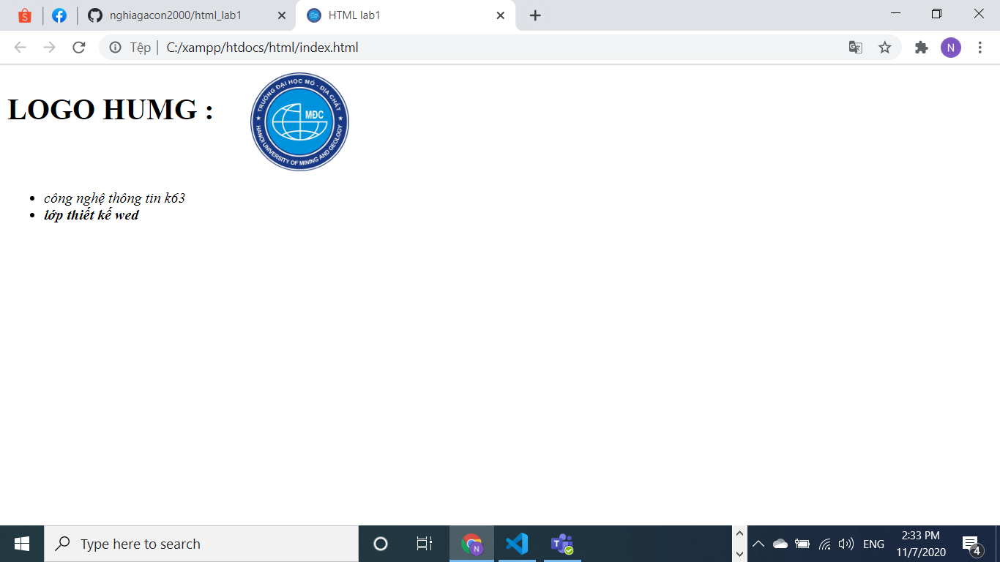

# html_lab1
```html
<!DOCTYPE html>
<html>
<head>
    <meta name="viewport" content="width=device-width, initial-scale=1.0">
    <meta charset="UTF-8">
    <link rel="shortcut icon" href="img/logo.jpg"/>
    <title>HTML lab1</title>
    
    
</head>
<body>
    <div class="container">
        <div class="row">
            <h1 style="float: left;">LOGO HUMG :</h1>
            
            <ul>
                <li><em>công nghệ thông tin k63<em></li>
                <li><strong>lớp thiết kế wed<strong></li>
                
            </ul>
        </div>
    </div>
</body>
</html>
```
## ảnh giao diện :

